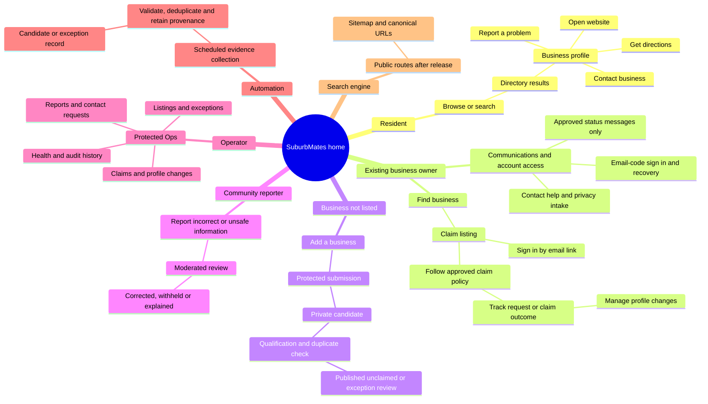

# SuburbMates — Complete User Journey Map

## Purpose and status

This is the owner-readable map of the finished SuburbMates experience. It starts with a person arriving at the home page and follows each person or system until its intent is complete. It covers the visible journey, the private work behind it, the background processes and the evidence Ops needs to safely operate the service.

It is the product-flow companion to the Target State and Operating Authority. It does not replace the detailed Operations Specification or the [Automation workflow map](../AUTOMATION/WORKFLOWS.md). Where this map describes a target flow that is not yet live, it is a build commitment, not a claim that the current holding site already provides it.

## The people and systems served

| Actor | What they are trying to achieve | Finished when |
| --- | --- | --- |
| Resident / visitor | Find a useful Darebin business and contact or visit it. | They reach accurate contact, website, directions or other stated next step. |
| Existing business owner | Find their existing listing, establish ownership and keep it accurate. | Their claim or requested update has a clear status and, when accepted, their change is reflected. |
| Business not yet listed | Tell SuburbMates about a real local business. | They submit a protected candidate and understand that review, not instant publication, follows. |
| Community reporter | Flag a wrong, unsafe, closed or duplicate listing. | The concern is recorded, triaged and resolved or explained. |
| Authorised operator | Keep the directory safe, useful and truthful without living in provider dashboards. | The relevant decision, exception or system problem is resolved and audit-recorded. |
| Scheduled automation | Gather and check evidence without making discretionary business decisions. | It creates a reviewable result, or a visible exception when it cannot. |
| Search engine | Discover public pages once public release is enabled. | It receives only the deliberate public routes, canonical URLs and sitemap entries. |

## Experience mind map

## 1. Home page: the common beginning

### What a visitor can do

The home page makes the product promise clear: find local Darebin businesses. Its primary actions are:

- **Browse businesses** — opens the directory or a category/suburb starting point.
- **Search** — takes a person to matching directory results.
- **Find or claim your business** — helps an owner look for an existing listing before asking them to create anything new.
- **Add a business** — starts a protected missing-business submission, not an instant public listing.
- **Report incorrect information / contact SuburbMates** — starts a safe concern or help path.

While the holding posture is active, these actions may correctly lead to a clear holding explanation rather than an unfinished journey. Once public release is authorised, every primary action must complete one of the journeys below.

### Shared information retained

The site should retain only the minimum useful operational evidence: anonymous abuse/rate-limit signals, consent where needed, submitted form content, status, timestamps, and a correlation identifier. Do not turn ordinary browsing into a CRM record or expose private submissions publicly.

## 2. Resident journey: find and use a business

1. The resident opens **Home** and chooses Browse or Search.
2. They see results that explain location/category context and distinguish trustworthy facts from owner-claimed or other supported signals.
3. They open a business profile.
4. They choose an intent: call, visit the business website, get directions, or use another stated contact method.
5. The journey is complete when they have reached the business's own next step; SuburbMates does not need to capture or sell the lead.

### Behind the page

- The public result and profile use only listing facts eligible for public display.
- Publication, ownership, ABN evidence and future commercial status remain separate.
- Canonical URLs, redirects and indexability are applied only after public release is enabled.
- A broken destination, missing fact or unsafe website can be reported without changing the listing automatically.

### What Ops needs to retain

- listing identity, displayed fields and public lifecycle status;
- source/provenance and last-check information for public facts;
- report identifier, reason, evidence and outcome when someone flags a problem; and
- an audit event for material correction, withholding or restoration decisions.

## 3. Existing-owner journey: claim and improve an existing listing

1. The owner enters through **Find or claim your business** or finds their listing through search.
2. They open the existing unclaimed profile and select **Claim this business**.
3. They sign in through the approved passwordless email path.
4. They follow the claim method approved for public release and can see what happens next.
5. The system shows a clear, explainable outcome or request state.
6. If the approved policy requires review, an authorised operator reviews the evidence and makes the ownership decision.
7. If approved, the owner can propose profile changes; those changes follow the moderation rule appropriate to the field. If not approved, the listing remains independently valid or invalid according to its publication state.
8. The journey is complete when the owner sees a final, explained claim result and any accepted profile change is reflected.

### Behind the page

- Authentication establishes who is signed in; it does not prove that they control a business.
- Claim evidence, conflict checks, decision reason and reviewer identity are private.
- Approval changes ownership only. It never creates publication, an ABN signal, payment status or a general "verified" badge by itself.
- Necessary transactional messages may confirm sign-in, request receipt, requests for more information and final outcomes. No uncontrolled marketing or automatic retries are implied.

### Claim-policy decision gate

**Approved owner decision:** an exact match to the listing's recorded contact email is the normal low-friction claim path. It must be paired with a protected exception, challenge, recovery and revocation path for conflicts, sensitive changes and non-matching evidence. A successful claim changes ownership only; it does not publish a listing or confer unrelated trust/commercial status.

The current repository's direct email-match implementation is not, by itself, proof that the full exception and revocation path exists. That work remains governed by the owner journey and Ops issues.

### Media and logo changes

An owner may eventually propose a logo or other listing media through the moderated profile-change journey. The flow must identify the source or permission basis, apply safe file/storage handling, show a pending state, and give Ops an approve, reject or remove decision. Media is never accepted merely because a user is authenticated.

### What Ops needs to retain

- claimant account reference, listing reference and request timestamps;
- submitted ownership evidence, redaction/access rules and conflict flags;
- claim status, decision, reason, reviewer and audit trail;
- proposed profile changes, before/after values, source/evidence and moderation outcome; and
- message-delivery outcome only where an approved transactional message was sent; and
- media source/permission evidence and moderation outcome when media is proposed.

## 4. Communications and account-access journey

This is a first-class service journey, not a background detail of claims or forms. It has two intentionally separate states.

### Current holding posture

The only approved outbound email is the passwordless sign-in code from `auth@suburbmates.com.au`. It supports the authorised operator's sign-in and recovery path, including when the email is read on another device. There is no public support inbox, contact dispatcher, marketing mail, bulk notification system or automatic retry loop.

### Finished public posture

Before any new message is enabled, `SUB-15` must approve a message catalogue. Each message must name its trigger, recipient, sender, content boundary, contact/consent basis, data retained, delivery failure state, retention rule and Ops action. A person must still be able to see their request status if a message cannot be delivered.

The possible public intents are:

1. **Account access:** request an email code, enter it in the browser being used, recover safely from an expired or superseded code, and reach only the authorised private area.
2. **Claim or profile request status:** see the status in the authenticated product; any email is an approved supplement, never the only record.
3. **Contact, help and privacy request:** select a plain-language request type, submit a private request, receive an honest on-screen outcome and, only where approved and permitted, a transactional reply.
4. **Submission or report outcome:** receive a status through the approved channel only when a contact basis exists and the message catalogue permits it.

### What Ops needs to retain

- message/request type, trigger, recipient reference and correlation identifier;
- the approved template/version or on-screen outcome, delivery result and failure reason where delivery occurs;
- contact permission, retention state and the private request/claim/report link; and
- the operator action and audit record for a material response, privacy request or delivery exception.

## 5. New-business journey: add a business that is not yet listed

1. A person selects **Add a business** from Home or a directory empty state, then searches first for an existing listing.
2. If it is missing, they choose one clear route: **I own or represent it** or **I am suggesting it**.
3. An owner or authorised representative signs in, supplies the minimum useful business facts and explains their connection. The system creates a **private candidate** and a **pending claim** together; neither publishes the business nor grants ownership.
4. A community suggester provides the minimum useful facts and a private status email. Their submission creates only a private candidate and no ownership request.
5. Validation and abuse controls reject obvious spam, malformed input and duplicates before anything becomes public.
6. Background and operator checks compare the candidate with approved sources, scope, duplicate records and safety concerns. The operator separately reviews any pending ownership evidence.
7. A qualifying candidate follows the approved directory-first lifecycle; an uncertain one becomes an Ops exception rather than a silent public listing.
8. The journey is complete when the submitter or owner can understand the private outcome, and the candidate and any claim have auditable decisions.

### Behind the page

- A submission is not a self-service profile creator and cannot overwrite an existing listing.
- An authenticated account can be both a community submitter and a business owner. Sign-in identifies the request account; only an approved claim creates the ownership link.
- An owner-submitted candidate is intentional evidence for a manual claim review, not an automatic claim or a substitute for the exact-email claim route for existing listings.
- Source, contact permission, evidence, anti-abuse signals and duplicate matches stay private.
- Automation may assist evidence gathering and matching, but cannot invent public facts or make discretionary publication/ownership decisions.

### What Ops needs to retain

- original submission, submission source, consent/contact preference and timestamps;
- validation/abuse outcome and any safe rate-limit or challenge result;
- candidate identity, duplicate candidates, provenance and qualification reasons;
- review queue state, decision reason, reviewer and audit history; and
- a link to the final listing only after a deliberate lifecycle decision.

## 6. Community-reporter journey: correct or flag a concern

1. A visitor selects **Report a problem** from a business profile or the contact path.
2. They choose a plain-language reason such as wrong details, duplicate, closed business, unsafe destination or another concern.
3. They provide enough detail for review; the site acknowledges receipt without promising an automatic change.
4. Abuse controls and moderation place the report in the appropriate private queue.
5. An operator checks evidence and corrects, withholds, merges, rejects or escalates the concern.
6. The journey is complete when the public record is safely resolved and, if a reply is appropriate and permitted, the reporter receives a factual outcome.

### Reconsideration, removal and privacy

A reporter, business owner or affected person must be able to understand the safe next step when they disagree with an outcome, need a factual correction, request removal/withholding, or make a privacy request. The request is private, explained and audit-recorded; it never silently deletes a listing or audit history. The exact public policy and eligibility rules are an approval item in `SUB-7`.

### What Ops needs to retain

- report type, listing reference, evidence and timestamps;
- reporter contact/consent only when supplied and necessary;
- moderation status, decision, reason, reviewer and linked audit event; and
- any resulting listing-state or public-fact change, with before/after evidence.

## 7. Operator journey: run the directory safely

1. The authorised operator signs in and reaches protected **Ops**.
2. The overview identifies work needing attention: listing exceptions, candidate reviews, claims, profile changes, reports, contacts and system health.
3. The operator opens one queue item, sees the evidence and makes one constrained decision.
4. The system validates authorisation, applies the permitted transition, preserves the reason and writes an audit event.
5. Ops shows the result immediately and makes a recovery/review path available where appropriate.
6. The journey is complete when the queue item has a reasoned, auditable state—not merely when a button has been pressed.

### Important operator boundaries

- Ops is not a replacement for Supabase, Stripe, Cloudflare or GitHub dashboards.
- Actions must not collapse publication, ownership, verification and commercial state into one control.
- A disabled integration must be shown as disabled, not simulated as working.
- Sensitive evidence is visible only to authorised operators and follows retention rules.

### What Ops needs to retain

- actor, authorisation result, action, timestamp and correlation identifier;
- prior state, new state, reason and supporting evidence;
- queue state, retry/recovery information and links to relevant system/job evidence; and
- immutable audit history for material lifecycle, claim, correction and security-sensitive actions.

## 8. Automation journey: evidence, not unchecked authority

1. A scheduled or manually initiated workflow starts with a visible run identity.
2. It acquires data from approved sources, applies bounded requests and validates the returned data.
3. It normalises, deduplicates and records provenance, check time, qualification signals and exceptions.
4. A healthy result produces a reviewable artifact or controlled candidate handoff. A failed or ambiguous result produces a visible exception with enough evidence to investigate.
5. It never publishes a raw record, grants ownership, resolves a claim, invents a public fact or changes commercial status.
6. The journey is complete when the result or failure is observable to the appropriate operator and linked to its run evidence.

### Technical companion

`docs/AUTOMATION/WORKFLOWS.md` is the implementation inventory for schedules, triggers, systems, artifacts and current operational status. This map defines why each automation exists and what it must not decide.

### What Ops needs to retain

- run identifier, trigger, version/correlation reference, timestamps and result;
- source endpoint, artifact reference, provenance, validation and duplicate outcomes;
- retry/fallback/error evidence and operator-visible exception state; and
- proof that no prohibited state-changing action was performed.

## 9. Search-engine journey: public discovery after release

1. Once the public launch gate is deliberately enabled, a crawler reaches only public, indexable routes.
2. It receives canonical URLs, permitted metadata and a sitemap containing only eligible public pages.
3. Redirects and removed/withheld records lead to the intended safe outcome.
4. The journey is complete when search engines have an accurate, maintainable representation of the public directory—not when a page is merely present in the database.

### Behind the page and for Ops

- The holding posture remains no-index with an empty sitemap until release.
- Indexability is independent of whether a record exists, is claimed or has an ABN.
- Ops needs route/sitemap checks, canonical/redirect evidence, release timestamp and any search visibility warnings without claiming control over search-engine indexing.

## Completion rules shared by every journey

- A journey completes on the person's real outcome, not when they enter a form.
- The UI always gives a clear next state: success, pending review, more information needed, unavailable, or safe recovery.
- Public facts are evidence-backed; private submissions and internal evidence never leak into public pages.
- Every meaningful decision is attributable, timestamped and reviewable.
- Automation failures become visible work, not silent data loss or automatic state changes.
- Holding posture, disabled features and release gates are stated honestly until they change through an authorised, verified release.

## Build sequencing implied by this map

1. Approve this map and reconcile it with the Target State, Operations Specification and current implementation.
2. Build the public directory discovery and profile journey with safe holding/release controls.
3. Approve the Communications and account-access journey in `SUB-15`; do not activate expanded delivery before this gate.
4. Build claims, owner status and moderated profile changes.
5. Build protected missing-business and concern-report journeys with Ops queues.
6. Build the audited candidate-to-Ops qualification handoff currently parked in Linear as `SUB-6`.
7. Verify each journey end-to-end: browser behaviour, database records, authorisation, background evidence and Ops observability.

Monetisation is intentionally absent from this sequence until a separate paid offer is approved.
