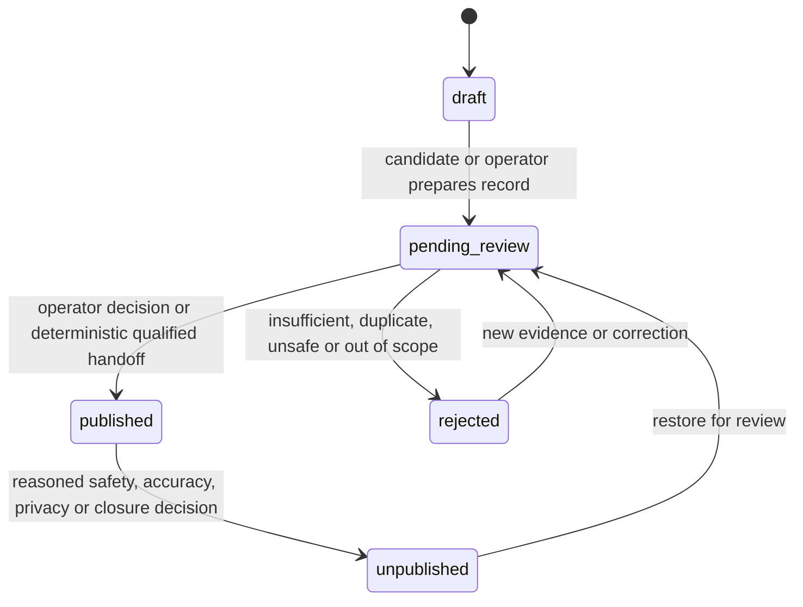

# SuburbMates — Listing Lifecycle and Release-State Contract

## Purpose

This contract turns the owner-approved directory policy into a buildable model. It deliberately keeps publication, site release, ownership, trust evidence, commercial presentation, provenance and SEO eligibility separate.

## State model

| Dimension | Meaning | Must not be changed by |
| --- | --- | --- |
| Listing lifecycle | `draft`, `pending_review`, `published`, `rejected`, `unpublished`. A listing's own directory eligibility. | Claim, ABN result, payment, tier or AI output alone. |
| Public release | The site-wide holding/release gate that controls whether otherwise published records are publicly browseable and indexable. | A database record being published. |
| Ownership | `unclaimed`, `claim_pending`, `claimed`, `owner_verified` where implemented. | Publication, ranking or SEO eligibility. |
| Trust evidence | Evidence records such as source, website and optional ABN checks. | A universal "verified" badge or publication automatically. |
| Commercial state | Free now; future paid entitlement only after a separate approved offer. | Publication, ownership, legitimacy, claim outcome or ranking. |
| Provenance | Source, source key/URL, checked time, qualification evidence and duplicate relationship. | Public display without the lifecycle decision. |
| SEO eligibility | Whether a public route/taxonomy page can be indexed. | Ownership, payment or mere database existence. |

## Current implementation inventory

- `vendors.listing_status` and `vendors.is_published` already implement the listing lifecycle and consistency check.
- `vendors.ownership_status`, `owner_id` and `is_claimed` are separate from publication.
- `listing_evidence`, source fields and audit events hold supporting provenance and decision history.
- `published_vendors` is a narrow public projection; it does not expose source, owner, moderation or internal lifecycle data.
- `taxonomy_page_eligibility` computes indexable taxonomy routes from published, evidence-backed listings. It is an SEO rule, not a new listing state.
- Protected Ops lifecycle functions require an operator, reason and audit event.

## Required corrections and boundaries

1. **Commercial neutrality:** public directory ranking must not order by `tier` or another commercial field. Commercial presentation belongs to its own future approved model.
2. **Qualified default publication:** the token-protected, versioned approved-source handoff may create a published, unclaimed listing only when the deterministic source, in-scope identity and category, duplicate and safety checks pass. A missing website, phone or email is not itself a disqualifier when the source record establishes a legitimate local business. It persists the handoff record, provenance, qualification evidence and audit event first. The legacy CSV importer still keeps ordinary new rows in `pending_review`; the pre-existing catalogue received the separate private `existing-catalogue-v2` evidence classification on 26 July 2026, without a lifecycle or visibility change.
3. **Public release remains separate:** a `published` listing becomes publicly browseable only while the global launch gate is enabled. The owner authorised the first public release on 23 July 2026; future release or rollback remains governed by `SUB-14`, not an import or claim.
4. **Claims remain independent:** the approved normal exact-email path and its future exception/revocation flow never publish a listing or change commercial/SEO state.
5. **Evidence remains precise:** an ABN or website result is stored as supporting evidence. It is not a universal entry requirement.
6. **Exceptional permanent deletion:** a protected operator may permanently delete one rejected listing only when it was never public and has no linked operational records. The operator must provide a reason and explicit confirmation; an append-only audit event remains. This is not a bulk clean-up tool and does not apply to public, unpublished or linked records.

## Allowed lifecycle transitions

Every transition requires the permitted actor, reason, timestamp and audit evidence. The candidate handoff is the narrow exception: it can create only a new unclaimed published listing after retaining deterministic qualification evidence; it cannot change ownership, resolve a claim, or publish a raw or exceptional candidate.

## `SUB-8` delivery boundary

`SUB-8` verifies and corrects the shared model: state separation, operator transition protection, public projection and non-commercial ranking. It did not itself enable automatic candidate publication, public release, claim exceptions, or billing; the later `SUB-6` candidate handoff owns the narrow deterministic creation path.

## Evidence required before review

- source-level tests for valid and prohibited transitions;
- a public-directory result proving neutral, non-commercial ordering;
- confirmation that public projection and holding gate remain unchanged;
- review of migration/RLS/audit impact; and
- no remote data mutation during verification unless a separately approved migration is ready.
